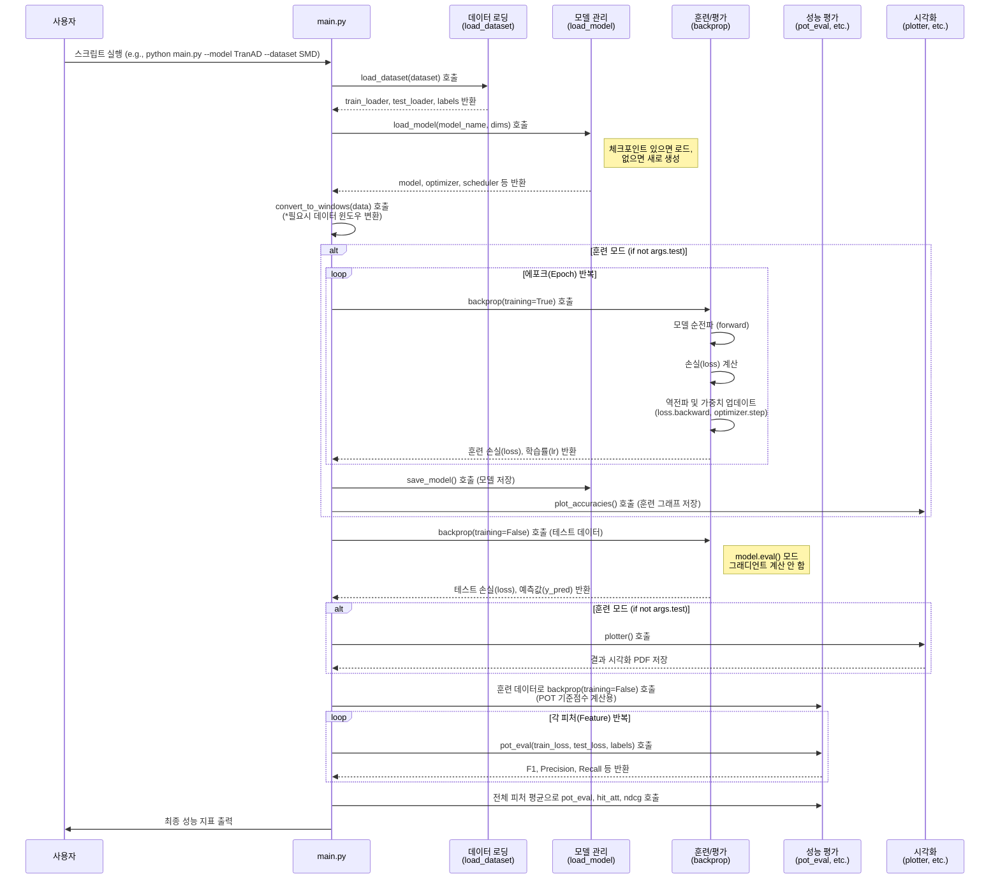

# TranAD 프로젝트 설명서

이 문서는 TranAD 프로젝트의 전체적인 코드 흐름과 학습에 사용되는 데이터의 구조를 설명합니다.

## 1. 코드 호출 흐름 다이어그램

아래는 `main.py` 실행 시의 함수 및 객체 호출 흐름을 나타낸 `mermaid` 시퀀스 다이어그램입니다.

---

## 2. 데이터셋 구조 및 입력 형태 설명서

### 2.1. 원본 데이터셋 구조 (`/data` 폴더)

-   프로젝트의 모든 원본 데이터는 `/data` 디렉토리 아래에 각 데이터셋의 이름으로 된 하위 폴더에 저장됩니다.
-   데이터셋의 형식은 각기 다릅니다.
    -   **SMD (Server Machine Dataset)**: `train/`과 `test/` 폴더에 머신별로 `.txt` 파일이 나뉘어 있습니다.
    -   **NAB (Numenta Anomaly Benchmark)**: `.csv` 파일과 레이블 정보가 담긴 `labels.json` 파일로 구성됩니다.
    -   **SMAP & MSL**: NASA에서 제공하는 데이터로, `train/`과 `test/` 폴더에 채널별로 `.npy` 파일이 존재합니다.
    -   **기타**: `SWaT`, `WADI` 등 다른 데이터셋들도 각자의 고유한 파일 구조와 형식을 가집니다.

### 2.2. 데이터 전처리 과정 (`preprocess.py`)

-   **목표**: 다양한 형태의 원본 데이터를 모델 학습에 사용될 일관된 형식인 **NumPy 배열(`.npy`)**로 변환합니다.
-   **실행**: `python preprocess.py <dataset_name>` 명령으로 특정 데이터셋을 전처리합니다.
-   **주요 단계**:
    1.  **로드**: `pandas`나 `numpy`를 사용해 원본 파일을 읽어들입니다.
    2.  **분할**: 데이터셋의 규칙에 따라 훈련(train) 데이터와 테스트(test) 데이터로 나눕니다.
    3.  **정규화 (Normalization)**: 모든 피처(feature)의 값 범위를 유사하게 맞추기 위해 **Min-Max 스케일링**을 적용하여 0과 1 사이의 값으로 변환합니다. 훈련 세트에서 학습된 스케일러를 테스트 세트에도 동일하게 적용하여 데이터 유출을 방지합니다.
    4.  **레이블 처리**: 텍스트, JSON 등 다양한 형태의 레이블을 `0`(정상)과 `1`(이상)로 구성된 이진(binary) 배열로 변환합니다.
-   **출력**: 전처리가 완료되면 `/processed/<dataset_name>/` 폴더 아래에 다음 세 개의 파일이 생성됩니다.
    -   `train.npy`: 훈련 데이터 (2D 배열, `[타임스탬프 수, 피처 수]`)
    -   `test.npy`: 테스트 데이터 (2D 배열, `[타임스탬프 수, 피처 수]`)
    -   `labels.npy`: 테스트 데이터에 대한 이상 레이블 (2D 배열, `[타임스탬프 수, 피처 수]`)

### 2.3. 모델 입력 형태 처리 (`main.py`)

-   `preprocess.py`를 통해 생성된 `.npy` 파일들이 모델의 최종 입력으로 사용되기까지 다음 단계를 거칩니다.

1.  **데이터 로딩**:
    -   `load_dataset` 함수가 `/processed` 폴더에서 `train.npy`, `test.npy` 파일을 로드합니다.
    -   데이터 전체가 하나의 배치(batch)로 `DataLoader`에 담깁니다. 즉, 모델은 전체 시계열 시퀀스를 한 번에 입력받아 처리합니다.

2.  **윈도우 변환 (Windowing)**:
    -   대부분의 시계열 모델(TranAD, USAD, LSTM 등)은 특정 시점의 데이터만 보는 것이 아니라, 이전 시점까지의 연속된 데이터를 함께 입력받아야 합니다.
    -   `convert_to_windows` 함수가 이 역할을 수행합니다.
    -   **입력**: `(전체 시퀀스 길이, 피처 수)` 모양의 2D 텐서.
    -   **처리**:
        -   `model.n_window` (e.g., 10) 크기의 "창문(window)"이 시계열 데이터를 한 타임스탬프씩 이동(slide)합니다.
        -   시점 `t`에서의 모델 입력은 `t` 이전의 `n_window`개 만큼의 데이터 시퀀스가 됩니다.
        -   예: `window_size=10`일 때, 100번째 시점의 입력 데이터는 `[90~99번째 시점의 데이터]`가 됩니다.
        -   데이터 시작 부분(0~9번째 시점)처럼 윈도우를 완전히 채울 수 없는 경우, 가장 첫 번째 데이터(`0`번째 시점)로 앞부분을 채웁니다(padding).
    -   **최종 입력 형태**:
        -   `convert_to_windows` 함수를 거친 데이터는 **`(전체 시퀀스 길이, 윈도우 크기, 피처 수)`** 모양의 3D 텐서가 됩니다.
        -   이 3D 텐서가 최종적으로 모델의 `forward` 함수에 입력됩니다.
        -   (참고: 일부 구형 모델은 윈도우를 평탄화(flatten)하여 `(전체 시퀀스 길이, 윈도우 크기 * 피처 수)` 형태의 2D 텐서를 입력으로 받기도 합니다.)
